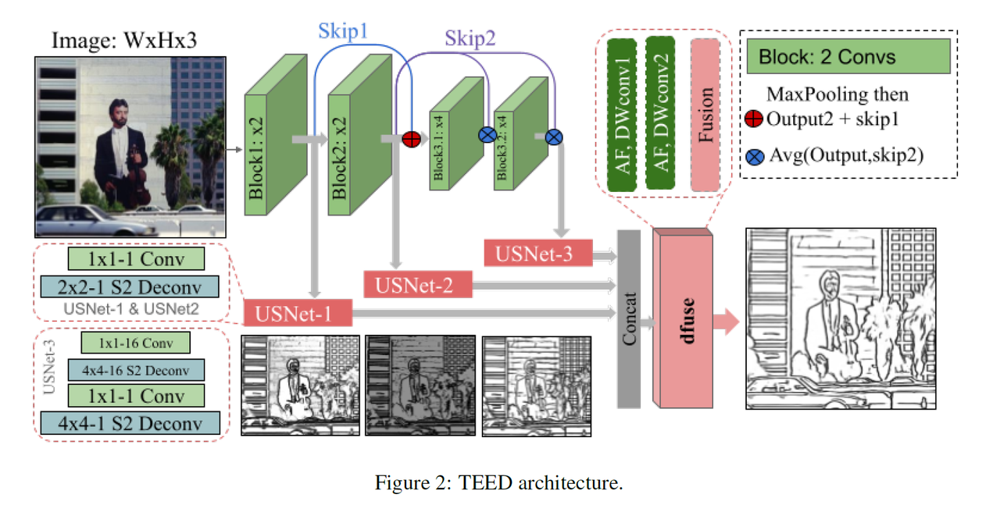

## Anyline

**A Fast, Accurate, and Detailed Line Detection Preprocessor**


Anyline is a ControlNet line preprocessor that accurately extracts object edges, image details, and textual content from most images. Users can input any type of image to quickly obtain line drawings with clear edges, sufficient detail preservation, and high fidelity text, which are then used as input for conditional generation in Stable Diffusion.

## Technical Details

The model and algorithms used in Anyline are based on innovative efforts stemming from the "Tiny and Efficient Model for the Edge Detection Generalization (TEED)" paper ([arXiv:2308.06468](https://arxiv.org/abs/2308.06468)). The TEED preset in ComfyUI also originates from this work, marking it as a powerful visual algorithm (TEED is currently the state-of-the-art). For more details, please refer to the paper.



## Comparison with Other Line Extraction Preprocessors

Anyline uses a processing resolution of 1280px, and hence comparisons are made at this resolution. Comparing with other commonly used line preprocessors, Anyline offers substantial advantages in contour accuracy, object details, material textures, and font recognition (especially in large scenes). It also performs better in reducing noise in most scenes, resulting in cleaner image processing with fewer inaccuracies during generation.


## Effects Overview

Anyline, in combination with the Mistoline ControlNet model, forms a complete SDXL workflow, maximizing precise control and harnessing the generative capabilities of the SDXL model. Anyline can also be used in SD1.5 workflows with SD1.5's ControlNet, although it generally performs better in the Anyline+MistoLine setup within the SDXL workflow.


**Note: The final result is highly dependent on the base model used. Please select the appropriate base model according to your needs.**

## Video Tutorial

Coming Soon!

## Installation

**To use Anyline as a ComfyUI plugin, you need to install comfyui_controlnet_aux first! You can follow the instructions here: https://github.com/Fannovel16/comfyui_controlnet_aux?tab=readme-ov-file#installation**

Once you have comfyui_controlnet_aux installed, follow these steps:

1. Open your IDE and ComfyUI command line, ensuring the Python environments match.
2. Navigate to the custom nodes directory:
   ```
   cd custom_nodes
   ```
3. Clone the repository, or manually download this repository and put it in the ComfyUI/custom_nodes directory:
   ```
   git clone https://github.com/TheMistoAI/ComfyUI-Anyline.git
   ```
4. Navigate to the cloned directory:
   ```
   cd ComfyUI-Anyline
   ```
5. Install dependencies:
   ```
   pip install -r requirements.txt
   ```
6. The model will automatically download upon first use. If this fails, manually download from [HuggingFace Repo](https://huggingface.co/TheMistoAI/MistoLine/tree/main/Anyline) and place the `.pth` file in the specified directory.

## ComfyUI Workflow

Upon installation, the Anyline preprocessor can be accessed in ComfyUI via search or right-click. The standard workflow using Anyline+Mistoline in SDXL is as follows  


You can download this workflow JSON here: [ComfyUI Workflow](Anyline%2BMistoLine_ComfyUI_workflow.json)

## Use in A1111 sd-webui-controlnet
Follow instruction in https://github.com/Mikubill/sd-webui-controlnet/discussions/2907.


## Limitations and Future Development

- Anyline may encounter difficulties with images that exhibit camera-like blurs or soft focus, and may require iterations based on community feedback.
- We also plan to contact the author of ComfyUI or the developer of ComfyUI-Controlnet to integrate Anyline into ComfyUI for easier future use.

## Citation

```bibtex
@InProceedings{Soria_2023teed,
    author    = {Soria, Xavier and Li, Yachuan and Rouhani, Mohammad and Sappa, Angel D.},
    title     = {Tiny and Efficient Model for the Edge Detection Generalization},
    booktitle = {Proceedings of the IEEE/CVF International Conference on Computer Vision (ICCV) Workshops},
    month     = {October},
    year      = {2023},
    pages     = {1364-1373}
}
```
